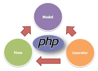

<div align="center">

  <h1 align="center">MVC php framework</h1>
  <p>An helper to implement the codebase of a PHP Framework following the MVC pattern</p>

  </img>

  <br>
  <br>

</div>

## Getting Started

1. **Download the Zip folder** and extract it on your machine.
2. **Put the folder on the `directory/www`** of your Wamp setup.
3. **Create a quick Database** on `phpMyAdmin`
4. **Add your constants variables** on the `config/` folder.
5. **Change the `.htaccess` file**: name your project and put that name to the .htaccess file in the `public/` folder
6. **Launch your localhost from WAMP**

<br>
<br>

### Config constants to change

These constants are to been update with your project.
You will find them on **the `app/config/config.php` file**.

```php
// DB Params
define('DB_HOST', 'localhost');
define('DB_USER', '_YOUR_USERNAME_');
define('DB_PASS', '_YOUR_PASSWORD_');
define('DB_NAME', '_YOUR_DBNAME_');

// App root
define('APP_ROOT',dirname(dirname(__FILE__))); 

// URL root
define('URL_ROOT', '_YOUR_URL_');

// Site name
define('SITE_NAME', '_YOUR_SITE_NAME_');
```

<br>
<br>

### Change the .htaccess file

This is **the `.htaccess` file** you have to update to your name project folder. 
You will find it, with **the following path, on the `public/.htaccess` file**.

You have **to switch `<YOUR_NAME_FOLDER>` by what's your app main project's name** is.

```
  RewriteBase /<YOUR_NAME_FOLDER>/public
```

<br>
<br>
<br>

## Structure

This helper is implemented with this clean and simple files's architecture.


```sh
app/
├── config
│   └── config.php
├── controllers
│   └── Pages.php
├── helpers
├── lib
│   ├── Controller.php
│   ├── Core.php
│   └── Database.php
├── models
├── views
│   ├── inc
│   |   ├── footer.php
│   |   └── header.php
│   └── pages
│       ├── about.php
│       └── index.php
├── .htaccess
└── bootstrap.php
public/
├── css
│   └── styles.css
├── images
├── js
│   └── main.js
├── .htaccess
└── index.php
.htacccess
README.md

```

<br>
<br>
<br>

## Start building your project

*In this section, I will document how to create your database, the models related to your project and so on.*

To be continued...